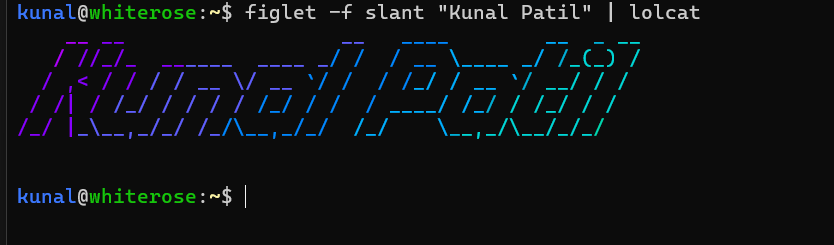

# Customizing the Linux Terminal with Figlet and Lolcat

In this step-by-step guide, we’ll show you how to customize your Linux terminal with **Figlet** and **Lolcat**, and automate the process using the `~/.bashrc` file. By the end, you’ll have a cool, colorful, and fun terminal greeting using the text "Your beautiful Name".

## Table of Contents

1. [Introduction](#introduction)
2. [Installing Figlet and Lolcat](#installing-figlet-and-lolcat)
3. [Creating ASCII Art with Figlet](#creating-ascii-art-with-figlet)
4. [Adding Colors with Lolcat](#adding-colors-with-lolcat)
5. [Automating with Aliases in bashrc](#automating-with-aliases-in-bashrc)
6. [Example Outputs](#example-outputs)
7. [Conclusion](#conclusion)


---

## Introduction

**Figlet** is a command-line tool that generates large characters out of ordinary text in ASCII format. **Lolcat** adds rainbow colors to the terminal output. Together, they can make your terminal greetings or commands visually appealing.

In this guide, we’ll use my name **"Kunal Patil"** as an example, but you can replace it with your own text.

---

## Installing Figlet and Lolcat

First, we need to install Figlet and Lolcat on your Linux system.

### For Debian/Ubuntu-based distributions:

```bash
sudo apt install figlet lolcat
```

### For Fedora:

```bash
sudo dnf install figlet lolcat
```

### For Arch Linux:

```bash
sudo pacman -S figlet lolcat
```

Once installed, you can check if the commands work by typing:

```bash
figlet --version
lolcat --version
```

---

## Creating ASCII Art with Figlet

Figlet transforms text into ASCII art. To try it out, run:

```bash
figlet "Kunal Patil"
```


## Screenshots


---
To see a list of available fonts, run:

```bash
 showfigfonts
```


Output:
## Screenshots


---

You can customize the font using the `-f` option. For example, to use the **slant** font:

```bash
figlet -f slant "Kunal Patil"
```

Output:

## Screenshots


---


## Adding Colors with Lolcat

Lolcat can add a rainbow of colors to the ASCII text generated by Figlet. Simply pipe the Figlet output into Lolcat:

```bash
figlet -f slant "Kunal Patil" | lolcat
```

This command will display the Figlet text in rainbow colors.

Here’s an example output:
## Screenshots




---

## Automating with Aliases in .bashrc or any ....rc fill

To make it easier to display your custom text, you can add an alias in your `~/.bashrc` file.

1. Open your `~/.bashrc` file in a text editor:

    ```bash
    nano ~/.bashrc
    ```
    

2. Add the following alias at the bottom of the file ading your name or any text :

    ```bash
    figlet -f slant -c "Your beautiful name " |lolcat
    ```

3. Save and exit the file by pressing `CTRL+X`, then `Y`, and hit `Enter`.

4. Reload the `~/.bashrc` file (**just close all terminal** ) to apply the changes:

    ```bash
    source ~/.bashrc
    ```

Now, your greet in your terminal, it will display **"Your geat name "** in colorful ASCII art.

For next tutorial **Follow kar Bhava !!!...**  
**Fallow karlo yaar!!!...**

---
## Example Outputs

Here are some examples of how your terminal output will look after following the steps:

### Example : Plain ASCII Text with Figlet

```bash
 figlet -f slant -c "Kunal Patil" |lolcat && figlet -f digital -c "A bug is never just mistake " |lolcat
```
## Output


## Conclusion

By combining **Figlet** and **Lolcat**, you can add some personality and color to your Linux terminal. Automating this process with an alias in your `~/.bashrc` makes it quick and easy to display colorful text whenever you want.

Feel free to experiment with different fonts, messages, and even add your custom text to your terminal prompt!

---

### License

This tutorial is licensed under the MIT License.
-

This tutorial walks through each step of the process with detailed instructions and example outputs using the text **"Kunal Patil"**. You can now add it to your GitHub repo along with the images! Let me know if you need further adjustments.

